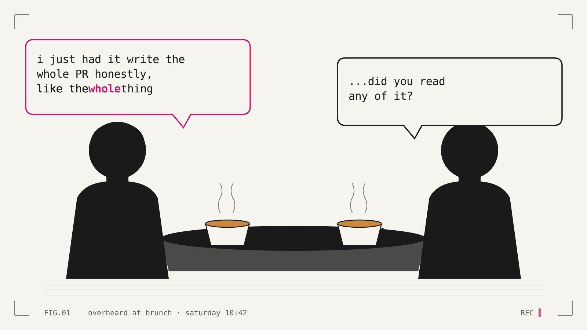

## Introduction

It is no secret that if you are in tech (or even STEM) right now, you can't go at least 15 minutes without talking about AI.

In fact, it is so bad at the moment that one calm Saturday morning over brunch while I was trying to decide between a flat white or the cold brew, I heard some random dude across from me try to convince his date that he does all of his work through AI; and that Gemini is better than ChatGPT. At this point, it is inescapable. I can't even have my slice of orange coconut cake without someone mentioning their "workflow" or how the future is being an "operator of agents".

> I don't even write my own emails anymore! Gemini does everything for me. It is like I work 3 hours a day and my boss doesn't even notice!

_Almost a direct quote from the douche-bro dude_

But working in tech means that I know that this is the reality of the world we live in. Wether we will become enablers of AI or burn through a thousand rain forests while the AMD stock prices climb... This is our reality. For better or for worse.

### Section One: What is this?

I've decided to write more than one article about this, so take this musing as part 1. It is just to get my thoughts out that has been _building_ for the last couple of weeks without any place to go.

Depending on which side of the table you're sitting I am either part of the solution or part of the problem. I have come to the realisation that regardless of which side I am on, we're basically all already on this ship. **Now what?** If I had to admit to something, I would have to add to my sins:

-   I have and I am directly working in teams to "enable AI" across organisations.
-   I use it on a daily basis. No, this article is written by my own grubby hands but that little image at the top? Yeah thank you Claude.
-   I talk about it. At work, at meetups. At conferences.
-   Heck, I even write tools and articles to other people can adopt it.

But that is _exactly_ my play. I don't want the wonderful people I work with to be left behind. I want us to get ahead of the curve even if I am not totally sure as to what that looks like.

### Section Two: Adoption

Some days it feels like we are in an adopt or die situation. I actually feel like I need to think a bit more about this adoption piece but I will say I have seen both sides of it.

Folks who push everything to the point of insanity through AI all the way to engineers who occasionally open Claude or Copilot to chat.

## Conclusion

Next I want to take a good look at what enablement actually means. Like for real how I have been doing it and how I have seen others doing it. I know that an adoption curve exists and I definitely fall into the early adopter category, but at the rate innovation is being demanded I want to try my best to do what I can to get as many folks as possible the tools they need to navigate this uncertain landscape.

Until the next one!
